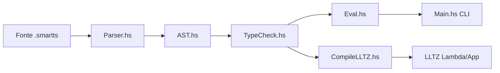

# Plano de Execução — Projeto 7 SmartTS

Documento de referência: [docs/09-projects.md](docs/09-projects.md) (Projeto 7 oficial: `@view`).

**Escopo deste plano:** implementar `@view` **e**, como ponto extra, lambdas com parâmetro tipado `(x: int) => ...`, mapeando para `Lambda { lamVar = (x, t); body = e }` do LLTZ.

**Equipe (5 pessoas):**

| Etapa | Responsável | Foco principal |
|-------|-------------|----------------|
| 1 | Integrante 1 | AST |
| 2 | Integrante 2 | Parser |
| 3 | Integrante 3 | Type checker |
| 4 | Integrante 4 | Interpreter |
| 5 | Integrante 5 | Testes, CLI, CodeGen |

**Ordem de integração:** Etapa 1 → 2 e 3 (paralelo) → 4 → 5.

**Nota sobre map/fold:** `map`/`fold` **não existem** na linguagem SmartTS hoje (só no IR LLTZ). Testes com map/fold ficam **bloqueados** até o Projeto 3/4; substituir por lambda aplicada diretamente ou passada a `@private` helper.

**Convenção de tipos:** SmartTS usa `int`, `bool`, `unit` (minúsculas), não `Int`.

---

## Contexto teórico geral

Antes de implementar, vale entender **onde** cada peça entra no compilador:

1. **AST** — representação intermediária: o código-fonte vira árvore, independente de texto.
2. **Parser** — traduz sintaxe concreta (`(x: int) => x + 1`) para nós da AST.
3. **Type checker** — prova que o programa é bem tipado antes de rodar; rejeita erros como aplicar `int -> int` em `bool`.
4. **Interpreter** — dá significado operacional: o que cada expressão *faz* em runtime.
5. **CodeGen** — rebaixa a AST tipada para LLTZ, IR já baseado em lambda-calculus usado na Tezos.

Hoje o SmartTS só tem **chamada nomeada** (`Call`): `helper(1, 2)` chama um método `@private` pelo nome. Lambdas introduzem **funções de primeira classe**: uma expressão pode *ser* uma função e ser passada/aplicada como valor. Isso é o núcleo do lambda-calculus: **abstração** (`λx. e`) e **aplicação** (`f a`).

O `@view` é diferente: não muda a sintaxe de expressões, mas classifica métodos como **somente leitura** — análogo às [on-chain views](https://tezos.com) da Tezos, que permitem consultar estado sem transação nem mutação persistente.

---

## Etapa 1 — AST (`lib/SmartTS/IR/AST.hs`)

**Responsável:** Integrante 1

### Teoria

A **AST (Abstract Syntax Tree)** é o contrato entre todas as fases do pipeline. Tudo que o parser reconhece, o type checker valida e o interpretador executa precisa existir como construtor na AST.

**`MethodKind View`** — classificação *nominal* de métodos. Assim como `@entrypoint` marca métodos invocáveis externamente, `@view` marca métodos de consulta. O kind não altera a forma do corpo; informa às fases seguintes qual *política* aplicar (ex.: proibir escrita em `storage`).

**`TFunction T1 T2`** — tipo de função, lido como `T1 -> T2`. Em teoria de tipos, funções são valores cujo tipo descreve domínio (argumento) e codomínio (resultado). Ex.: `(x: int) => x + 1` terá tipo `int -> int`.

**`Lambda param tipo body`** — *abstração*: expressão que representa uma função anônima ainda não avaliada. Corresponde ao `\x : T . e` do lambda-calculus tipado. O tipo do parâmetro é explícito na sintaxe (requisito do projeto).

**`App fn arg`** — *aplicação*: avaliar `fn` com `arg`. Diferente de `Call name args`, que resolve um nome estático para um método `@private`. `App` funciona com qualquer expressão que avalie para uma função.

**`Closure ... env`** — valor de **runtime**, não aparece no código-fonte. Quando uma lambda é *criada*, variáveis livres do corpo (definidas fora dela) precisam ser lembradas — isso é uma **closure** (função + ambiente capturado). Ex.: em `val y: int = 10; (x: int) => x + y`, a lambda captura `y`. Sem `Closure`, o interpretador não teria onde guardar esse ambiente.

### Antes vs Depois desta etapa

**Antes (como o projeto está hoje):**

- A AST só descreve contratos Tezos com métodos `@originate`, `@entrypoint` e `@private`.
- Tipos são apenas escalares (`int`, `bool`, `unit`) e records — não há como representar `int -> int`.
- Expressões cobrem literais, operadores e `Call` (chamada a método pelo nome). Não existe nó para lambda nem aplicação de função como valor.
- O IR LLTZ (`lib/SmartTS/IR/LLTZ.hs`) já tem `Lambda` e `App`, mas a AST de surface não — não há ponte entre os dois.
- Escrever `(x: int) => x + 1` no código sequer teria *onde* ser representado na árvore.

**Depois (o que muda ao concluir a Etapa 1):**

- A AST passa a ser o **vocabulário completo** das features novas: `@view`, tipos de função, lambda, app e closure.
- Todas as fases seguintes (parser, type checker, eval) terão construtores para pattern-match — mas **ainda não sabem usá-los**.
- O projeto **não compila** até as etapas 2–4 implementarem os casos faltantes nos outros módulos (exhaustividade do Haskell).
- Nenhum comportamento visível ao usuário muda ainda: é só a fundação de dados.

### O que tem agora

- `MethodKind`: `Originate | EntryPoint | Private` (linhas 19–22)
- `Type`: `TInt | TBool | TUnit | TRecord` — sem tipos de função (linhas 29–33)
- `Expr`: literais, ops, `Call` para métodos `@private` — sem `Lambda`, `App`, `Closure` (linhas 37–60)
- `exprAnn`: casos para todos os construtores atuais, sem lambda/app (linhas 63–85)

### Script a alterar

[lib/SmartTS/IR/AST.hs](lib/SmartTS/IR/AST.hs)

### Linhas e alterações

**Linhas 19–22** — adicionar construtor `View` em `MethodKind`:

```haskell
data MethodKind = Originate
                | EntryPoint
                | Private
                | View
  deriving (Eq, Show)
```

**Linhas 29–33** — adicionar tipo de função:

```haskell
data Type = TInt
          | TBool
          | TUnit
          | TRecord [(Name, Type)]
          | TFunction Type Type   -- T1 -> T2
  deriving (Eq, Show)
```

**Linhas 59–60** — novos construtores de expressão (antes do `deriving`):

```haskell
  | Lambda  a Name Type (Expr a)                          -- (x: T) => body
  | App     a (Expr a) (Expr a)                           -- f(arg)
  | Closure a Type Name (Expr a) (M.Map Name TypedExpr)   -- valor de runtime
```

Adicionar `import qualified Data.Map.Strict as M` no topo do módulo.

**Linhas 63–85** — estender `exprAnn`:

```haskell
exprAnn (Lambda a _ _ _)    = a
exprAnn (App a _ _)         = a
exprAnn (Closure a _ _ _ _) = a
```

### Como fazer

- `Lambda`: representação estática (parser + type checker produzem isso)
- `App`: aplicação de expressão arbitrária (diferente de `Call` que é só nome de método)
- `Closure`: criado **somente** pelo interpretador ao avaliar `Lambda`; guarda ambiente capturado (`locals` + `params` no momento da criação)

### Como deve ficar (trecho)

```haskell
| Call    a Name [Expr a]
| Lambda  a Name Type (Expr a)
| App     a (Expr a) (Expr a)
| Closure a Type Name (Expr a) (M.Map Name TypedExpr)
```

### Resultado após a alteração

A AST declara `@view`, `TFunction`, `Lambda`, `App` e `Closure`. Próximo passo: parser (Etapa 2) e type checker (Etapa 3) passam a referenciar esses construtores. Sem eles, `cabal build` quebra por casos não cobertos em `inferExpr`, `evalExpr`, etc.

---

## Etapa 2 — Parser (`lib/SmartTS/Parser.hs`)

**Responsável:** Integrante 2

### Teoria

O **parser** faz *análise sintática*: verifica se o texto obedece a gramática e monta a AST. Erros aqui são "código inválido" (ex.: `(x: int) =>` sem corpo).

**Decorator `@view`** — anotação lexical antes do nome do método, igual a `@entrypoint`. O parser só precisa reconhecer o token e produzir `MethodKind View`; a *semântica* (proibir mutação) fica para o type checker.

**Sintaxe lambda `(x: T) => e`** — escolha explícita de tipo no parâmetro, estilo TypeScript/arrow function. O parser lê: parêntese, nome, `:`, tipo, `)`, `=>`, corpo. O corpo é uma expressão completa (pode ser `x + 1`, outra lambda, etc.).

**Tipos com `->`** — `int -> bool -> int` deve parsear como `int -> (bool -> int)` (associativo à direita). Funções currificadas: cada `->` adiciona um argumento.

**Aplicação postfix `e(args)`** — convenção comum em linguagens funcionais. Após parsear um termo, `(...)` aplica o termo como função. Importante manter `ident(...)` como `Call` quando `ident` é nome simples — isso preserva a semântica existente de métodos `@private` com múltiplos argumentos (`helper(a, b)`).

**Conflito `( ... )`** — parênteses servem tanto para lambda quanto para agrupar expressões. A disambiguação é pelo padrão `( nome : tipo ) =>`: se bater, é lambda; senão, é expressão entre parênteses.

### Antes vs Depois desta etapa

**Antes (após Etapa 1, sem parser atualizado):**

- A AST tem os nós novos, mas o parser **não os produz** — texto `(x: int) => x + 1` é rejeitado como sintaxe inválida.
- `@view` no código-fonte não é reconhecido; cai como token desconhecido ou método sem decorator.
- Tipos como `int -> int` em anotações (`val f: int -> int = ...`) não parseiam.
- `helper(1, 2)` funciona como `Call`; expressões como `((x: int) => x)(5)` não existem na gramática.
- Contratos existentes (`samples/Counter.smartts`) continuam parseando igual.

**Depois (o que muda ao concluir a Etapa 2):**

- Código-fonte com `@view`, lambdas, tipos `->` e aplicação postfix vira **AST concreta** (ex.: `Lambda () "x" TInt (Add ...)`).
- Dá para inspecionar a árvore via testes de parser ou `show` — mas **type checker ainda não valida** lambdas/views e **interpretador ainda não executa**.
- `helper(a, b)` continua sendo `Call` (comportamento antigo preservado).
- Erros nesta fase são de **sintaxe** ("parse failed"), não de tipo ou runtime.

### O que tem agora

- `parseMethodKind` (270–274): `@originate`, `@entrypoint`, `@private` — sem `@view`
- `parseType` (56–75): primitivos e records — sem `->`
- `parseAtom` (117–124): sem lambda; `parseVarOrCall` (134–140) trata `ident(...)` como `Call`
- `parseTerm` (106–110): só postfix `.campo`, sem aplicação postfix

### Script a alterar

[lib/SmartTS/Parser.hs](lib/SmartTS/Parser.hs)

### Linhas e alterações

**Linhas 270–274** — incluir `@view`:

```haskell
parseMethodKind =
  (symbol "@originate" >> return Originate)
    <|> (symbol "@entrypoint" >> return EntryPoint)
    <|> (symbol "@private" >> return Private)
    <|> (symbol "@view" >> return View)
```

**Linhas 293–298** — prioridade do decorator em `parseMethod`:

```haskell
  let kind
        | Originate  `elem` decorators = Originate
        | EntryPoint `elem` decorators = EntryPoint
        | View       `elem` decorators = View
        | otherwise                    = Private
```

**Linhas 56–75** — tipos com seta (associativa à direita):

Substituir `parseType` por:

```haskell
parseType :: Parser Type
parseType = parseArrowType
  where
    parseArrowType = do
      t <- parseNonFunType
      mrest <- optional (symbol "->" *> parseArrowType)
      return (maybe t (\r -> TFunction t r) mrest)

    parseNonFunType = parseRecordType <|> parsePrimitiveType
    -- parseRecordType e parsePrimitiveType permanecem iguais
```

**Linhas 106–110** — aplicação postfix + campos:

```haskell
parseTerm :: Parser ParsedExpr
parseTerm = do
  base <- parseAtomOrStorage
  e <- foldM (\acc f -> pure (FieldAccess () acc f)) base =<< many (symbol "." *> parseName)
  foldM applyApp e =<< many (parens (sepBy parseExpr (symbol ",")))
  where
    applyApp fn args =
      case args of
        [arg] -> pure (App () fn arg)
        _     -> fail "function application expects exactly one argument"
```

**Linhas 117–124** — lambda antes de `parens parseExpr`:

```haskell
parseAtom =
  parseLambda
    <|> parseUnit
    <|> parseRecordExpr
    <|> parseBool
    <|> parseInt
    <|> parseVarOrCall
    <|> parens parseExpr

parseLambda :: Parser ParsedExpr
parseLambda = do
  _ <- symbol "("
  name <- parseName
  _ <- symbol ":"
  typ <- parseType
  _ <- symbol ")"
  _ <- symbol "=>"
  body <- parseExpr
  return (Lambda () name typ body)
```

**Importante:** `parseVarOrCall` continua igual — `helper(1, 2)` vira `Call`, não `App`. Lambdas e expressões entre parênteses usam `App` via postfix.

### Como fazer

- Sintaxe lambda: `(x: int) => x + 1`
- Aplicação: `((x: int) => x + 1)(5)` — lambda parseada em `parseLambda`, `(5)` vira `App` em `parseTerm`
- Tipos de função em anotações: `val f: int -> int = ...`

### Resultado após a alteração

O parser reconhece toda a sintaxe nova e monta a AST correta. Um contrato com `return ((x: int) => x + 1)(5);` parseia sem erro. Type checking falha na Etapa 3 (casos faltando ou tipos errados) e execução falha na Etapa 4.

---

## Etapa 3 — Type Checker (`lib/SmartTS/TypeCheck.hs`)

**Responsável:** Integrante 3

### Teoria

O **type checker** implementa o sistema de tipos: garante que operações só ocorrem entre valores compatíveis. SmartTS usa checagem **bidirecional** — `inferExpr` deduz tipos de expressões; `expectType` compara com tipos esperados (returns, anotações).

**Regra de introdução de lambda** (tipos de função — regra *I→*):

```
  Ambiente estendido com x : T1 ⊢ body : T2
  ─────────────────────────────────────────
       ⊢ (x: T1) => body : T1 -> T2
```

Ao checar o corpo, o parâmetro entra no ambiente (`envBindings`) em escopo local (`withSavedEnv`), igual a um `val` — evita conflito com variáveis externas de mesmo nome.

**Regra de eliminação de aplicação** (regra *E→*):

```
  ⊢ fn : T1 -> T2    ⊢ arg : T1
  ─────────────────────────────
         ⊢ fn(arg) : T2
```

Se `fn` não for `TFunction`, erro de tipo. Se `arg` não bater com `T1`, erro — ex.: `((x: int) => x + 1)(true)`.

**`envReadOnly` para `@view`** — análise de *efeitos* estática, não de tipos de expressão. Views são métodos que **não podem produzir efeito de escrita** em `storage`. O flag percorre o ambiente de checagem; ao encontrar `AssignmentStmt` cujo alvo é `storage` ou `storage.campo`, rejeita. Isso espelha a garantia Tezos: views consultam estado on-chain sem alterá-lo.

**`Call` vs `App` no type checker** — `Call` consulta `envFunctionSignatures` (só `@private`); `App` usa tipos de função na própria expressão. São dois mecanismos de "chamar código": nominal (nome fixo) vs estrutural (valor função).

### Antes vs Depois desta etapa

**Antes (após Etapas 1–2, sem type checker atualizado):**

- Lambdas e apps parseiam, mas passam pelo type checker **sem regra** — ou o build quebra por caso faltante em `inferExpr`.
- Não há como saber se `(x: int) => x + 1` é `int -> int` ou se `((x: int) => x + 1)(true)` é erro.
- Método `@view` que faz `storage.x = 1` **passa** na checagem — nenhuma restrição de efeito.
- `typesEqual` não compara `TFunction`; anotações `val f: int -> int` não funcionam.
- Contratos antigos continuam tipando como antes (sem regressão, se casos novos forem adicionados sem alterar os existentes).

**Depois (o que muda ao concluir a Etapa 3):**

- Expressões lambda recebem tipo `T1 -> T2`; aplicações são validadas (domínio/codomínio).
- Erros de tipo em lambdas/apps/views são detectados **antes** de rodar (ex.: argumento `bool` onde esperava `int`).
- `@view` com escrita em `storage` é **rejeitado em compile-time** com mensagem clara.
- AST tipada (`TypedExpr`) carrega anotações corretas em `Lambda` e `App`.
- **Interpretador ainda não executa** lambdas — contrato bem tipado com lambda pode falhar em runtime na Etapa 4.

### O que tem agora

- `TcEnv` (26–31): sem flag read-only para views
- `checkMethod` (84–107): não trata `View`
- `checkStmt` `AssignmentStmt` (129–134): permite escrita em `storage`
- `inferExpr` (200–256): sem `Lambda`/`App`; `Call` só para `@private`
- `typesEqual` / `prettyType` (304–324): sem `TFunction`

### Script a alterar

[lib/SmartTS/TypeCheck.hs](lib/SmartTS/TypeCheck.hs)

### Linhas e alterações

**Linhas 26–31** — flag no ambiente:

```haskell
data TcEnv = TcEnv
  { envStorageType :: Type
  , envBindings :: M.Map Name TcBinding
  , envFunctionSignatures :: M.Map Name Signature
  , envReturnType :: Type
  , envReadOnly :: Bool          -- True para métodos @view
  }
```

Inicializar `envReadOnly = False` em `checkMethod` (linha 92–98); se `methodKind m == View`, usar `True`.

**Linhas 129–134** — bloquear escrita em storage em views:

```haskell
checkStmt (AssignmentStmt lv e) = do
  ro <- gets envReadOnly
  when (ro && assignsStorage lv) $
    tcError "Cannot assign to `storage` in a @view method."
  -- resto igual
```

Adicionar helper:

```haskell
assignsStorage :: LValue -> Bool
assignsStorage LStorage = True
assignsStorage (LField root _) = assignsStorage root
assignsStorage _ = False
```

**Após linha 256** — regras de lambda e app:

```haskell
inferExpr (Lambda () param paramTy body) = do
  tbody <- withSavedEnv $ do
    noDuplicateLocal param
    modify $ insertLocal param LocalImmutable paramTy
    inferExpr body
  let fnTy = TFunction paramTy (exprAnn tbody)
  return (Lambda fnTy param paramTy tbody)

inferExpr (App () fn arg) = do
  tfn <- inferExpr fn
  targ <- inferExpr arg
  case exprAnn tfn of
    TFunction t1 t2 -> do
      lift $ expectType "function application argument" (exprAnn targ) t1
      return (App t2 tfn targ)
    _ -> tcError $
      "Expected function type in application, got " ++ prettyType (exprAnn tfn) ++ "."

inferExpr (Closure _ _ _ _ _) =
  tcError "Closure values cannot appear in source code."
```

**Linhas 304–311** — igualdade de tipos de função:

```haskell
typesEqual (TFunction a1 b1) (TFunction a2 b2) =
  typesEqual a1 a2 && typesEqual b1 b2
```

**Linhas 313–324** — pretty-print:

```haskell
prettyType (TFunction t1 t2) = prettyType t1 ++ " -> " ++ prettyType t2
```

### Regras de tipo

| Expressão | Regra |
|-----------|-------|
| `(x: T1) => body` | tipo `T1 -> T2` onde `T2` = tipo de `body` |
| `f(arg)` | se `f: T1 -> T2` e `arg: T1`, resultado `T2` |
| `@view` body | qualquer `storage = ...` ou `storage.campo = ...` → erro |

### Resultado após a alteração

Programas com lambdas/views inválidos falham no type check; programas válidos geram `TypedContract` pronto para execução. `((x: int) => x + 1)(true)` rejeitado; `((x: int) => x + 1)(5)` aceito com tipo `int`. Próximo passo: interpretador (Etapa 4) dar significado operacional.

---

## Etapa 4 — Interpreter (`lib/SmartTS/Interpreter/`)

**Responsável:** Integrante 4

### Teoria

O **interpretador** define a **semântica operacional**: passo a passo, o que acontece quando o programa roda. SmartTS usa avaliação de expressões em monad `State Runtime` (estado = storage, params, locals, methods).

**Avaliação de lambda → closure** — uma lambda *não* executa o corpo imediatamente. Ela produz um **valor função** (closure) que empacota: parâmetro, corpo e snapshot do ambiente (`locals` + `params` visíveis). Isso implementa **escopo léxico**: free variables resolvem onde a lambda foi *definida*, não onde foi *aplicada*.

**Aplicação (`App`)** — avaliação **call-by-value**: primeiro `fn`, depois `arg`; então cria ambiente interno com o parâmetro ligado ao valor do argumento e executa o corpo. Mutações em `storage` dentro da lambda propagam de volta — mesma regra do `Call` existente.

**`Call` vs `App` em runtime**:

| | `Call name args` | `App fn arg` |
|---|---|---|
| Alvo | método `@private` pelo nome | qualquer valor `Closure` |
| Ambiente | params do método, locals vazios | params = captura + argumento |
| Recursão | via `rtMethods` | closure não tem nome |

**`@view` em runtime** — `callViewWithJsonArgs` executa o corpo igual a um entrypoint (lê storage, avalia expressões), mas **não grava** storage de volta no repositório. O type checker já garantiu que o corpo não escreve; mesmo que escrevesse por bug, a persistência omitida isola o efeito. Dois modos de execução, mesmo interpretador — só muda o passo final de persistência.

### Antes vs Depois desta etapa

**Antes (após Etapas 1–3, sem interpretador atualizado):**

- Contrato com lambda **tipa corretamente**, mas ao executar quebra (caso faltante em `evalExpr`) ou ignora lambdas.
- Única forma de "chamar código" em runtime: `Call` para métodos `@private` (dispatch in-process, sem closure).
- Valores em runtime são só `CInt`, `CBool`, `Record`, etc. — **não existem funções como valor**.
- `@view` não tem caminho de execução dedicado; mesmo que parseie e type-check, não há `callViewWithJsonArgs`.
- `--call` sempre persiste storage após entrypoint — não há modo read-only.

**Depois (o que muda ao concluir a Etapa 4):**

- `((x: int) => x + 1)(5)` **avalia para** `6` em runtime; closures capturam variáveis externas.
- Lambdas são valores de primeira classe dentro do interpretador (via `Closure`).
- `@view` pode ser executada programaticamente via `callViewWithJsonArgs` — lê storage, retorna resultado, **repo inalterado**.
- `@entrypoint` / `@private` mantêm comportamento anterior (`Call`, persistência de storage).
- **CLI ainda não expõe `--view`** (Etapa 5); **testes automatizados** e **codegen LLTZ** ainda pendentes.

### O que tem agora

- `Eval.hs` `evalExpr` (15–82): sem `Lambda`/`App`/`Closure`
- `Contract.hs`: só `findEntryPointByName` + `callEntrypointWithJsonArgs` (sempre persiste storage)
- Closures inexistentes; `Call` faz dispatch de método `@private`

### Scripts a alterar

- [lib/SmartTS/Interpreter/Eval.hs](lib/SmartTS/Interpreter/Eval.hs)
- [lib/SmartTS/Interpreter/Contract.hs](lib/SmartTS/Interpreter/Contract.hs)

### Eval.hs — linhas ~82+ (após caso `Call`)

**Captura de ambiente:**

```haskell
captureEnv :: Runtime -> M.Map Name TypedExpr
captureEnv rt =
  M.union (fmap bindingValue (rtLocals rt)) (rtParams rt)
```

**Avaliar lambda (cria closure):**

```haskell
evalExpr (Lambda ty param _ body) = do
  rt <- get
  return (Closure ty param body (captureEnv rt))
```

**Avaliar app (aplica closure):**

```haskell
evalExpr (App _ fn arg) = do
  fnVal <- evalExpr fn
  argVal <- evalExpr arg
  case fnVal of
    Closure _ param body captured -> do
      outerRt <- get
      let innerRt = outerRt { rtParams = M.insert param argVal captured
                            , rtLocals = M.empty }
      (ret, innerRt') <- lift $ runStateT (evalExpr body) innerRt
      modify $ \r -> r { rtStorage = rtStorage innerRt' }
      return ret
    _ -> interpretBug "application target was not a function after type check"
```

**Closure como valor final:**

```haskell
evalExpr c@(Closure _ _ _ _) = return c
```

Semântica alinhada ao `Call` existente: mutações em `storage` dentro da lambda propagam para o caller.

### Contract.hs — novas funções (~115+)

```haskell
findViewByName :: TypedContract -> Name -> Either String (MethodDecl Type)
findViewByName c name =
  case filter (\m -> methodKind m == View && methodName m == name) (contractMethods c) of
    []  -> Left $ "No @view named \"" ++ name ++ "\"."
    [m] -> Right m
    _   -> Left $ "Multiple @view methods named \"" ++ name ++ "\"."

callViewWithJsonArgs ::
  RepositoryState -> TypedContract -> Address -> Name -> String -> Value
  -> Either String (Maybe TypedExpr, RepositoryState)
callViewWithJsonArgs repo c addr viewName sourceText argsJson = do
  -- igual callEntrypointWithJsonArgs até execMethodWithInitialStorage
  -- mas NÃO atualiza instanceStorage no repo — retorna repo intacto
  ...
```

### Resultado após a alteração

Lambdas executam com closures; aplicações retornam valores concretos (`6`, etc.). Views rodam via API interna sem alterar o repositório. Pipeline parse → typecheck → eval funciona end-to-end **via código Haskell**, mas ainda sem testes automatizados, CLI `--view` ou tradução LLTZ (Etapa 5).

---

## Etapa 5 — Testes, CLI e CodeGen

**Responsável:** Integrante 5

### Teoria

Esta etapa **valida e expõe** o que as etapas 1–4 construíram — não adiciona semântica nova, mas confirma que o pipeline inteiro funciona.

**Testes de compilador** — convém testar cada fase isoladamente:

- **Parser**: entrada inválida falha; entrada válida produz AST esperada (forma da árvore).
- **Type checker**: contratos bem tipados passam; erros de tipo falham com mensagem (não precisa checar mensagem exata).
- **Interpreter**: contrato parseado + tipado + executado retorna valor esperado (ex.: `6`).

Testar fases separadas localiza bugs: se parser passa mas type checker falha, o problema está na etapa 3, não na 1.

**CLI `--view`** — interface de usuário para o modo read-only. Espelha `--call`, mas invoca `callViewWithJsonArgs`. Separação clara: entrypoints mutam estado on-chain; views só leem e retornam JSON.

**CodeGen → LLTZ** — *lowering*: traduzir AST de alto nível para IR mais próximo do Michelson. LLTZ já tem `Lambda`, `App` e `TFunction`. A tradução é quase 1:1:

```
SmartTS:  Lambda x T body     →  LLTZ: Lambda (LambdaBinder (x, T) body')
SmartTS:  App fn arg          →  LLTZ: App fn' arg'
SmartTS:  TFunction T1 T2     →  LLTZ: TFunction T1 T2
```

`Closure` não traduz — existe só durante interpretação em Haskell; código compilado para Tezos usaria `Lambda`/`App` do LLTZ diretamente, sem closure explícita (captura vira `LetIn`/`LetMutIn` na tradução completa, fora do escopo mínimo deste projeto).

**map/fold** — em LLTZ existem `MapColl` e `FoldLeft`, mas SmartTS ainda não tem `list<T>`. Testar lambda com map fica para quando coleções existirem; por ora, testar aplicação direta `((x: int) => x + 1)(5)` cobre o essencial.

### Antes vs Depois desta etapa

**Antes (após Etapas 1–4, sem testes/CLI/codegen):**

- Features novas funcionam **manualmente** (via GHCi ou execução ad-hoc), mas nada garante que continuem funcionando após mudanças futuras.
- `cabal test` cobre só parser/type-checker antigos — lambdas, views e interpreter **não têm regressão automática**.
- Usuário da CLI só pode `--originate` e `--call`; consultar `@view` exige chamar `callViewWithJsonArgs` direto no código Haskell.
- `CompileLLTZ.hs` não traduz `Lambda`/`App` — ponte para Michelson permanece incompleta para funções.
- Não há sample `.smartts` demonstrando lambda + view juntos.

**Depois (o que muda ao concluir a Etapa 5 — projeto entregue):**

- `cabal test` verde com casos de parse, type error, type success e avaliação de lambda/view.
- CLI expõe `--view` para consultas read-only pelo terminal, espelhando `--call`.
- CodeGen emite `Lambda`/`App`/`TFunction` no LLTZ — alinhado ao mapeamento acadêmico pedido pelo professor.
- Sample em `samples/` documenta uso real das features.
- **Estado final do Projeto 7:** linguagem aceita `@view` + lambdas tipadas em todo o pipeline (parse → check → eval → codegen parcial).

### O que tem agora

- [test/Main.hs](test/Main.hs): parser + type checker; **zero** testes de interpreter, `@view`, lambda
- [app/Main.hs](app/Main.hs): `--originate` e `--call` apenas
- [lib/SmartTS/CodeGen/CompileLLTZ.hs](lib/SmartTS/CodeGen/CompileLLTZ.hs): stub parcial (linha 23 TODO)

### Scripts a alterar

- [test/Main.hs](test/Main.hs)
- [app/Main.hs](app/Main.hs)
- [lib/SmartTS/CodeGen/CompileLLTZ.hs](lib/SmartTS/CodeGen/CompileLLTZ.hs)
- (opcional) [samples/Lambda.smartts](samples/Lambda.smartts)

### test/Main.hs — novos testes (~505+)

**Parser — lambdas:**

```haskell
, testCase "Lambda expression parse" $
    parseSuccess "... @entrypoint t(): int { return (x: int) => x + 1; }" $ \c ->
      case ... of ReturnStmt (Lambda _ "x" TInt _) -> return ()
```

**Parser — @view:**

```haskell
, testCase "Method with @view decorator" $
    parseSuccess "... @view getCount(): int { return storage.count; }" $ \c ->
      case ... MethodDecl View "getCount" ... -> return ()
```

**Type checker — lambda:**

```haskell
, testCase "Lambda int -> int" $
    typeCheckSuccess "contract C { storage: { x: int }; @entrypoint t(): int { return ((x: int) => x + 1)(5); } }"
, testCase "App argument type mismatch" $
    typeCheckFailure "... return ((x: int) => x + 1)(true); ..."
, testCase "View cannot write storage" $
    typeCheckFailure "... @view bad(): unit { storage.x = 1; return (); }"
```

**Interpreter — helper + testes** (adicionar imports de `execMethodWithInitialStorage`):

```haskell
runEntrypointReturn :: String -> String -> Either String TypedExpr
-- parse → typeCheck → execMethodWithInitialStorage → extrair retorno

, testCase "Lambda application evaluates to 6" $
    case runEntrypointReturn "... ((x: int) => x + 1)(5) ..." "t" of
      Right (CInt _ 6) -> return ()
      other -> assertFailure (show other)
```

**map/fold:** bloqueado até Projeto 3 — documentar com comentário no teste.

### app/Main.hs — modo `--view` (~20–110, ~152–199)

- Novo `CmdView` em `CliCmd`
- Flag `--view` no parser de CLI
- `runView`: igual `runCall`, mas chama `callViewWithJsonArgs` e **não** persiste storage alterado

Usage:

```text
smart-ts --view --repo <dir> --address <KT1...> --view <name> --args '{}'
```

### CompileLLTZ.hs — linhas 6–23

```haskell
translateType (A.TFunction t1 t2) =
  L.TFunction (translateType t1) (translateType t2)

translateExpression (A.Lambda ty param paramTy body) =
  L.Expr (L.Lambda (L.LambdaBinder (L.Var param, translateType paramTy) (translateExpression body))) (translateType ty)

translateExpression (A.App ty fn arg) =
  L.Expr (L.App (translateExpression fn) (translateExpression arg)) (translateType ty)
```

`Closure` não traduz (só runtime).

### Resultado após a alteração

Projeto 7 completo e verificável: testes automatizados, CLI com `--view`, codegen LLTZ para lambdas, exemplo em `samples/`. Qualquer regressão futura é pega por `cabal test`. Integração final: merge das 5 etapas + `cabal build && cabal test`.

---

## Fluxo do pipeline



---

## Checklist de entrega (PR)

- [ ] `cabal test` passa
- [ ] Exemplo em `samples/` com lambda + `@view`
- [ ] Nenhuma dependência externa nova
- [ ] PR descreve mudança por arquivo (1 parágrafo cada)

## Bloqueios conhecidos

| Item | Status |
|------|--------|
| Testes map/fold com lambda | Bloqueado — `list<T>`/`map<K,V>` não existem na surface |
| Serializar `Closure` em JSON | Fora de escopo — views/entrypoints não retornam funções por JSON hoje |
| `@view` + lambda no mesmo método | Suportado — view pode chamar lambda localmente |

## Estimativa de esforço por pessoa

Cada etapa ~40–80 linhas de código + testes correspondentes na etapa 5. Integração final: rodar `cabal build && cabal test` após merge das branches individuais.
